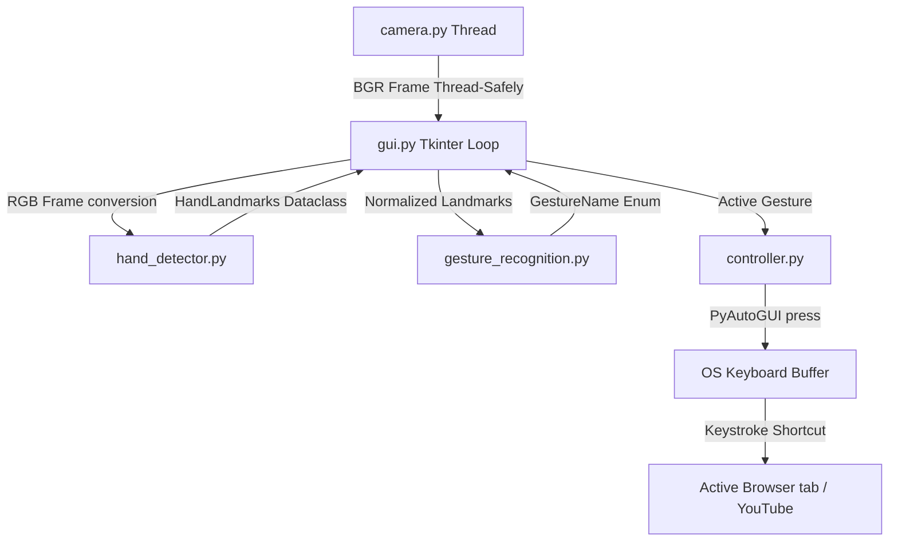
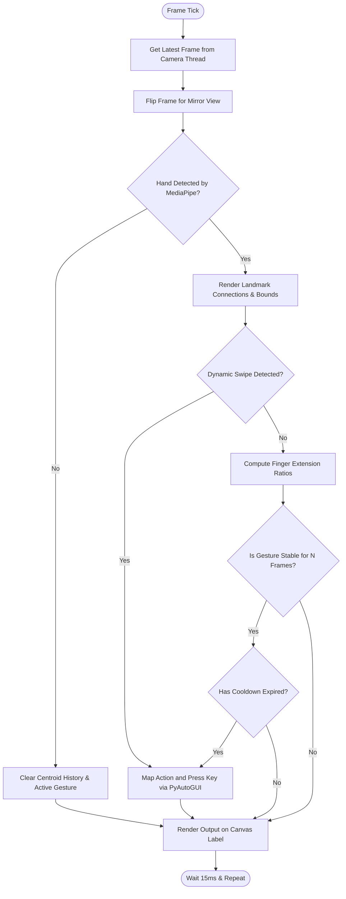

# YouTube Gesture Controller using Computer Vision

A professional desktop application that allows users to control YouTube playback and browser actions using real-time hand gestures captured via a webcam. Built with Python, OpenCV, MediaPipe, CustomTkinter, and PyAutoGUI.

---

## Project Overview

This project is a modular, production-ready computer vision application designed for desktop environments. It utilizes **MediaPipe Hands** to extract 21 coordinate points of the human hand, processes these points through a custom scale-invariant geometric classification engine, and maps the resulting gestures to virtual keyboard shortcuts targeting active YouTube browser tabs. 

It features a modern, responsive **CustomTkinter** GUI dashboard which displays the camera stream, hand tracking annotations, performance diagnostics (such as thread frame rate and CPU processing rate), active gesture classification, and event logs.

---

## Features

- **Multi-Threaded Acquisition**: Keeps the graphical interface running smoothly by processing video capture in a dedicated background thread.
- **Robust Landmark Detection**: Maps 21 hand landmarks in real-time, displaying structural connections and custom-labeled bounding boxes.
- **Scale-Invariant Classification**: Determines finger extension status and gestures using relative mathematical distance ratios and angle evaluations (independent of how close the hand is to the camera).
- **Dynamic Swipe Tracking**: Employs coordinate trajectory buffering (FIFO queue) to detect rapid left/right swipe movements.
- **System Stability & Filtering**: Avoids duplicate commands and flickering using temporal debouncing filters, category-specific execution cooldowns, and hysteresis buffers.
- **Fault-Tolerant Webcam Controller**: Automatically attempts connection retry intervals if the camera disconnects during runtime.
- **Modern Dashboard Design**: Outfitted with a dark-mode CustomTkinter user interface, performance diagnostics, toggle buttons, and an interactive gesture manual.

---

## Technology Stack

- **Python 3.11+**: Core development environment.
- **OpenCV (opencv-python)**: Video stream ingestion, preprocessing, and image format conversion.
- **MediaPipe**: Real-time hand landmark tracking and world spatial coordinate mapping.
- **NumPy**: Matrix coordinate translations and bounding box scaling.
- **PyAutoGUI**: Keyboard command emulation targeting active operating system windows.
- **CustomTkinter**: Modern, dark-mode desktop window styling.
- **Pillow (PIL)**: High-fidelity image type conversions and resizing (LANCZOS interpolation).
- **Python Logging (Standard Library)**: Unified file rotating logging and console output tracking.

---

## Folder Structure

```text
YouTube-Gesture-Controller/
│
├── config.py                 # Configuration settings (constants, thresholds, keybindings)
├── logger.py                 # Centralized rotating file and console logging
├── utils.py                  # Math helper tools (angles, distances, smoothing, FPS)
├── camera.py                 # Threaded webcam frame capture wrapper
├── hand_detector.py          # MediaPipe hand tracker interface
├── gesture_recognition.py    # Hand shape and swipe classifier rules
├── controller.py             # Keystroke dispatcther and cooldown manager
├── gui.py                    # CustomTkinter dashboard layout and loop
├── main.py                   # Main bootstrap entry point
│
├── requirements.txt          # Third-party dependency definitions
├── README.md                 # Complete documentation
└── LICENSE                   # MIT License file
```

---

## Installation

1. **Clone the Repository**:
   ```bash
   git clone https://github.com/yourusername/YouTube-Gesture-Controller.git
   cd YouTube-Gesture-Controller
   ```

2. **Set up a Virtual Environment** (Recommended):
   ```bash
   python -m venv venv
   # On Windows:
   venv\Scripts\activate
   # On macOS/Linux:
   source venv/bin/activate
   ```

3. **Install Dependencies**:
   ```bash
   pip install --upgrade pip
   pip install -r requirements.txt
   ```

---

## How to Run

1. Connect a webcam to your machine.
2. Launch the application:
   ```bash
   python main.py
   ```
3. Open a YouTube video in your active browser window.
4. Position your hand inside the camera frame visible on the application GUI and perform hand gestures to automate playback.

---

## Gesture Table

| Hand Gesture | Mapped Action | YouTube Shortcut | Description |
| :--- | :--- | :--- | :--- |
| **Closed Fist** | Play / Pause | `k` | Toggle playback of the active video |
| **Open Palm** | Mute | `m` | Toggle audio mute / unmute |
| **Thumb Up** | Volume Up | `up` | Incrementally increase audio level |
| **Thumb Down** | Volume Down | `down` | Incrementally decrease audio level |
| **Victory Sign** | Full Screen | `f` | Toggle browser fullscreen view |
| **Three Fingers** | Theater Mode | `t` | Toggle browser theater view layout |
| **Four Fingers** | Toggle Captions | `c` | Toggle closed caption subtitles |
| **Swipe Right** | Skip Forward 10s | `l` | Rapidly seek video forward by 10s |
| **Swipe Left** | Skip Backward 10s | `j` | Rapidly seek video backward by 10s |

---

## Architecture Diagram

The diagram below outlines the communication pathways between the threaded components, mathematical processing blocks, and automation dispatchers:



---

## Processing Flowchart

The flowchart below demonstrates the frame-by-frame execution logic during a single update tick of the application's graphic event loop:



---

## Future Enhancements

- **Hand Distance Threshold Scaling**: Automatically dynamically adjust swipe detection distance thresholds depending on the hand's distance from the camera.
- **Custom Shortcut Mapper**: Integrate a configuration tab on the GUI sidebar allowing users to customize shortcut keys for alternative web players (e.g. Vimeo, Netflix).
- **Secondary Hand Automation**: Add support for dual-hand detection (e.g. left hand controls volume sliders, right hand controls seek sliders).

---

## License

This project is licensed under the MIT License - see the [LICENSE](LICENSE) file for details.
